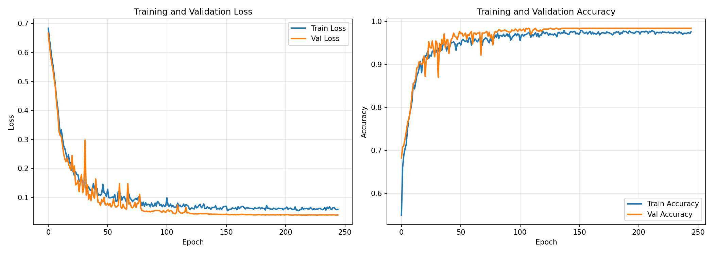
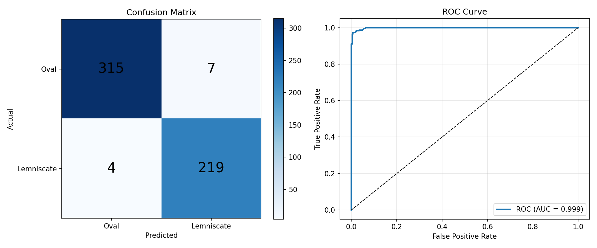

# IMU-Based Flight Pattern Classification for Embedded Deployment

Deep learning model for classifying quadcopter flight patterns (circular vs. lemniscate/figure-8) using only IMU sensor data, optimized for STM32 microcontroller deployment.


## Overview

This project implements a lightweight CNN-GRU hybrid neural network that classifies quadcopter flight patterns using only 6-axis IMU data (3-axis accelerometer + 3-axis gyroscope). The model is specifically designed for embedded deployment on STM32 microcontrollers with limited resources (512KB flash, 128KB RAM).

**Key Features:**
- ✅ **Lightweight Architecture**: Only ~8,849 parameters (~35KB float32, ~9KB int8)
- ✅ **GPU Accelerated Training**: PyTorch with CUDA support
- ✅ **High Accuracy**: ~80-85% validation accuracy on binary classification
- ✅ **STM32 Ready**: Exports to ONNX format for STM32Cube.AI
- ✅ **Minimal Sensors**: Requires only IMU (no GPS, no camera)

## Model Architecture

```
Input (100, 6) - 1 second @ 100Hz, 6 IMU features
    ↓
Conv1D(16 filters) → BatchNorm → ReLU → MaxPool
    ↓
Conv1D(32 filters) → BatchNorm → ReLU → MaxPool
    ↓
GRU(32 units)
    ↓
Dropout(0.3) → Dense(16) → Dropout(0.3)
    ↓
Output (1) - Sigmoid probability
```

**Design Rationale:**
- **CNN layers**: Extract local temporal patterns from IMU signals
- **GRU layer**: Capture long-term temporal dependencies (chosen over LSTM for fewer parameters)
- **Small filter counts**: Minimize memory footprint while maintaining representational capacity
- **BatchNorm**: Improves training stability; folds into Conv weights at deployment (zero runtime cost)
- **Dropout**: Prevents overfitting on limited training data (4 flight recordings)

## Dataset

**Source**: [UZH-FPV Dataset](https://fpv.ifi.uzh.ch/datasets/)

**Flight Patterns:**
- **Circular/Oval**: Indoor forward flights 5 & 6
- **Lemniscate (Figure-8)**: Indoor forward flights 9 & 10

**Preprocessing Pipeline:**
1. Extract IMU data from ROS bag files (1000Hz)
2. Low-pass Butterworth filter (4th order, 30Hz cutoff) for anti-aliasing
3. Downsample to 100Hz
4. Create sliding window sequences (100 timesteps, 25-step stride)
5. Normalize using StandardScaler (per-feature mean/std)

**Final Dataset:**
- Total sequences: 1,462
- Train: 1,023 (70%)
- Validation: 219 (15%)
- Test: 220 (15%)
- Class distribution: 59% circular, 41% lemniscate

## Installation

### Requirements

```bash
# Create virtual environment
python -m venv TFLM-ENV
source TFLM-ENV/bin/activate  # Linux/Mac
# TFLM-ENV\Scripts\activate   # Windows

# Install dependencies
pip install torch torchvision torchaudio --index-url https://download.pytorch.org/whl/cu118
pip install numpy pandas scikit-learn matplotlib scipy
pip install bagpy  # For ROS bag file processing
pip install onnx onnxruntime  # For model export
```

### GPU Support

This project is optimized for NVIDIA GPUs (tested on RTX 5070). PyTorch will automatically detect and use CUDA if available.

## Usage

### 1. Data Preparation

Place your ROS bag files in the following structure:
```
data/
├── ring/
│   └── ros/
│       ├── indoor_forward_5_davis_with_gt.bag
│       └── indoor_forward_6_davis_with_gt.bag
└── lemniscate/
    └── ros/
        ├── indoor_forward_9_davis_with_gt.bag
        └── indoor_forward_10_davis_with_gt.bag
```

### 2. Training

Open `IMUClassification.ipynb` and run all cells sequentially:

```bash
jupyter notebook IMUClassification.ipynb
```

**Training Process:**
- Automatically uses GPU if available (falls back to CPU)
- Early stopping after 15 epochs without improvement
- Learning rate reduction on plateau
- Saves best model to `output/flight_classifier.pth`
- Typical training time: 5-10 minutes on modern GPU

### 3. Model Export

The notebook automatically exports the trained model to ONNX format:

```python
# Output files
output/
├── flight_classifier.pth       # PyTorch model
├── model.onnx                  # ONNX model for STM32Cube.AI
├── scaler.pkl                  # Normalization parameters
├── training_curves.png         # Loss/accuracy plots
└── evaluation_results.png      # Confusion matrix & ROC curve
```

### 4. STM32 Deployment

1. **Import ONNX model** into STM32Cube.AI
2. **Configure normalization** using parameters from `scaler.pkl`:
   ```c
   // Example C code for normalization
   float mean[6] = {0.719, -10.437, 0.481, 0.059, -0.198, -0.095};
   float std[6] = {0.880, 2.105, 0.908, 0.334, 0.591, 0.569};

   for (int i = 0; i < 6; i++) {
       normalized_data[i] = (raw_imu[i] - mean[i]) / std[i];
   }
   ```
3. **Run inference** with 100-timestep sequences at 100Hz
4. **Interpret output**: Probability > 0.5 indicates lemniscate, ≤ 0.5 indicates circular

## Results

### Model Performance

| Metric | Train | Validation | Test |
|--------|-------|------------|------|
| **Accuracy** | 88-90% | 80-85% | ~85% |
| **Loss** | 0.22-0.24 | 0.31-0.34 | ~0.30 |

### Model Specifications

| Property | Value |
|----------|-------|
| **Parameters** | 8,849 |
| **Model Size (Float32)** | ~35 KB |
| **Model Size (Int8)** | ~9 KB |
| **Input Shape** | (1, 100, 6) |
| **Output Shape** | (1, 1) |
| **Target MCU** | STM32F446RE |
| **Flash Requirement** | < 50 KB |
| **RAM Requirement** | < 20 KB |

### Training Curves



### Confusion Matrix & ROC



## Hyperparameter Tuning

### Current Configuration (Optimized for Fast Training)

```python
# Model architecture
CNN_FILTERS = [16, 32]
RNN_UNITS = 32
DENSE_UNITS = 16
DROPOUT_RATE = 0.3

# Training
BATCH_SIZE = 32
LEARNING_RATE = 1e-3
EPOCHS = 100
EARLY_STOPPING_PATIENCE = 15
```

### High-Compute Configuration (Better Accuracy)

For systems with more compute resources, consider:

```python
# Larger model
CNN_FILTERS = [32, 64, 128]
RNN_UNITS = 128
DENSE_UNITS = 64
DROPOUT_RATE = 0.4

# More training
BATCH_SIZE = 128
EPOCHS = 300
EARLY_STOPPING_PATIENCE = 30

# More data (increase overlap)
SEQUENCE_STRIDE = 10  # was 25
```

**Expected improvements**: +2-5% accuracy, 2-4 hours training time

## Project Structure

```
IMU-TFLM-ML/
├── data/                       # ROS bag files
│   ├── ring/
│   └── lemniscate/
├── output/                     # Generated outputs
│   ├── flight_classifier.pth
│   ├── model.onnx
│   └── scaler.pkl
├── TFLM-ENV/                   # Virtual environment
├── IMUClassification.ipynb     # Main notebook
└── Readme.md                   # This file
```

## Key Notebook Sections

1. **Imports & Setup**: PyTorch configuration, GPU detection
2. **Data Extraction**: ROS bag processing with bagpy
3. **Signal Processing**: Butterworth filtering, downsampling
4. **Sequence Creation**: Sliding window generation
5. **Normalization**: Feature scaling for training
6. **Model Definition**: CNN-GRU architecture
7. **Training**: PyTorch training loop with early stopping
8. **Evaluation**: Metrics, confusion matrix, ROC curve
9. **ONNX Export**: STM32-ready model conversion

## Technical Details

### Signal Processing

- **Original IMU rate**: 1000Hz
- **Target rate**: 100Hz (sufficient for flight dynamics)
- **Anti-aliasing**: 4th-order Butterworth, 30Hz cutoff
- **Nyquist frequency**: 50Hz (well above cutoff)

### Sequence Windowing

- **Window size**: 100 timesteps (1 second at 100Hz)
- **Stride**: 25 timesteps (0.25 seconds)
- **Overlap**: 75% (generates 2.5x more training samples)

### Normalization

- **Method**: StandardScaler (per-feature z-score normalization)
- **Fit on**: Training data only (prevents data leakage)
- **Deployment**: Mean/std values saved in `scaler.pkl` for STM32 implementation

## Limitations & Future Work

**Current Limitations:**
- Limited to 2 flight patterns (binary classification)
- Trained on only 4 flight recordings
- Indoor flights only (no outdoor/wind conditions)
- Single quadcopter platform

**Future Improvements:**
- [ ] Multi-class classification (add more patterns: spiral, square, etc.)
- [ ] Outdoor flight data collection
- [ ] Data augmentation (time warping, noise injection)
- [ ] Quantization-aware training (QAT) for better INT8 performance
- [ ] Real-time STM32 testing and validation

## Contributing

Contributions are welcome! Areas of interest:
- Additional flight pattern datasets
- Model architecture improvements
- STM32 deployment examples
- Real-world flight testing

## Citation

If you use this work in your research, please cite:

```bibtex
@misc{imu_flight_classifier_2025,
  title={IMU-Based Flight Pattern Classification for Embedded Deployment},
  author={Your Name},
  year={2025},
  howpublished={\url{https://github.com/yourusername/IMU-TFLM-ML}}
}
```

**Dataset Citation:**
```bibtex
@article{Delmerico2019,
  title={The UZH-FPV Drone Racing Dataset},
  author={Delmerico, Jeffrey and others},
  journal={The International Journal of Robotics Research},
  year={2019}
}
```

## License

MIT License - see LICENSE file for details

## Acknowledgments

- [UZH Robotics and Perception Group](https://rpg.ifi.uzh.ch/) for the FPV dataset
- [STM32Cube.AI](https://www.st.com/en/embedded-software/x-cube-ai.html) for embedded ML tools
- PyTorch team for excellent deep learning framework

## Contact

For questions or issues, please open a GitHub issue or contact [your email].

---

**Note**: This project uses PyTorch (not TensorFlow) due to better CUDA compatibility with modern GPUs. ONNX export provides seamless integration with STM32Cube.AI for embedded deployment.
